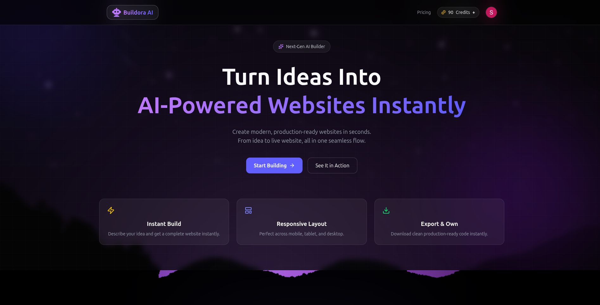
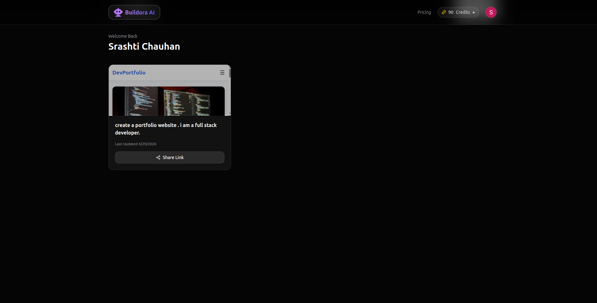
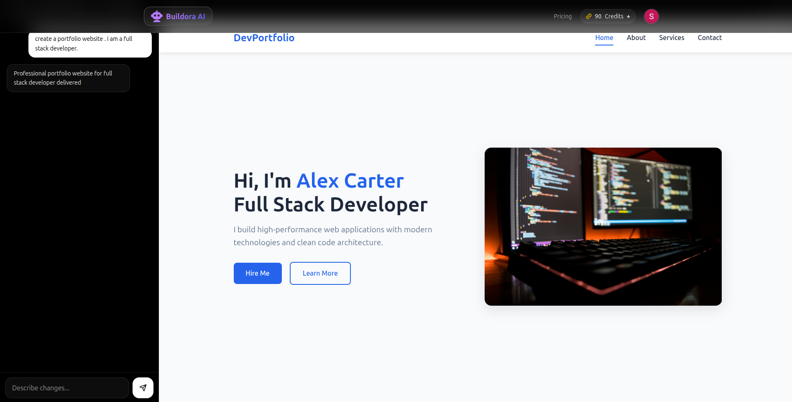

# 🚀 Buildora AI — AI-Powered Website Builder

<p align="center">
  
  
  
  
</p>

---


**🌐 Live Demo** https://buildora-ai-five.vercel.app


---

## 📌 Overview

**Buildora AI** is a full-stack **SaaS platform** that allows users to generate, edit, and deploy complete websites using AI.

It simulates a real-world production system with:

* Authentication
* Credit-based usage
* Payment integration
* Public deployment

---

## 🎯 Problem Statement

Traditional website development requires time, technical expertise, and effort.

Buildora AI solves this by enabling users to **generate production-ready websites instantly using AI**, reducing development time from hours to seconds.

---

## ✨ Key Features

* 🧠 AI-powered website generation (HTML, CSS, JS)
* 🎯 Credit-based system (10 credits generate / 5 modify)
* ✏️ Modify websites using AI prompts
* 🚀 One-click deployment with shareable URL
* 🌍 Public website viewing via `/site/:slug`
* 🔐 Google Authentication (Firebase + JWT)
* 💳 Razorpay payment integration

---


## 🔄 Application Flow

```text
1. User visits frontend (React - Vercel)

2. Authentication:
   → Login via Firebase (Google)
   → Backend generates JWT
   → Stored in HTTP-only cookies

3. Website Generation:
   → User enters prompt
   → Frontend → Backend (/generate)
   → Backend → OpenRouter API
   → AI returns HTML
   → Stored in MongoDB

4. Dashboard:
   → Fetch user websites (protected API)

5. Deployment:
   → Backend generates unique slug
   → Public URL created:
     /site/:slug

6. Public Access:
   → WebsiteViewer loads
   → Calls /getbyslug (NO auth)
   → Renders HTML using iframe

7. Payments:
   → Razorpay integration
   → Credits updated in database
```

---

## ⚙️ Tech Stack

### 🧠 Frontend

* React.js (Vite)
* Redux Toolkit
* Tailwind CSS
* Axios

### 🔥 Backend

* Node.js
* Express.js
* MongoDB (Mongoose)
* JWT Authentication

### 🤖 AI Integration

* OpenRouter API (DeepSeek Model)

### 🔐 Authentication

* Firebase Google Auth

### 💳 Payments

* Razorpay

### ☁️ Deployment

* Vercel (Frontend)
* Render (Backend)
* MongoDB Atlas

---

## 📂 Project Structure

```bash
Buildora-AI/
│
├── backend/
│   ├── config/
│   ├── controllers/
│   ├── database/
│   ├── middlewares/
│   ├── models/
│   ├── routes/
│   ├── utils/
│   ├── index.js
│   └── .env
│
├── frontend/
│   ├── public/
│   ├── src/
│   │   ├── components/
│   │   ├── layout/
│   │   ├── pages/
│   │   │   ├── Dashboard.jsx
│   │   │   ├── Generate.jsx
│   │   │   ├── WebsiteEditor.jsx
│   │   │   └── WebsiteViewer.jsx
│   │   ├── redux/
│   │   ├── config.js
│   │   ├── firebase.js
│   │   ├── App.jsx
│   │   └── main.jsx
│   ├── index.html
│   └── .env
│
├── screenshots/
│   ├── homepage.png
│   ├── dashboard.png
│   └── preview.png
│
└── README.md
```

---

## 📸 Screenshots

### 🏠 Homepage


### 📊 Dashboard


### 🌍 Generated Website Preview



---

## ⚡ Getting Started

### 1️⃣ Clone Repository

```bash
git clone https://github.com/your-username/buildora-ai.git
cd buildora-ai
```

---

### 2️⃣ Setup Backend

```bash
cd backend
npm install
npm run dev
```

Create `.env`:

```env
PORT=8000
MONGO_URI=your_mongodb_uri
SECRET_KEY=your_secret_key
OPENROUTER_API_KEY=your_api_key
FRONTEND_URL=http://localhost:5173
RAZORPAY_KEY_ID=your_key
RAZORPAY_SECRET=your_secret
```

---

### 3️⃣ Setup Frontend

```bash
cd frontend
npm install
npm run dev
```

Create `.env`:

```env
VITE_SERVER_URL=http://localhost:8000
VITE_FIREBASE_API_KEY=your_key
VITE_RAZORPAY_KEY_ID=your_key
```

---

## 🔐 Environment Variables (Production)

### Backend (Render)

* MONGO_URI
* SECRET_KEY
* OPENROUTER_API_KEY
* FRONTEND_URL
* RAZORPAY_KEY_ID
* RAZORPAY_SECRET

### Frontend (Vercel)

* VITE_SERVER_URL
* VITE_FIREBASE_API_KEY
* VITE_RAZORPAY_KEY_ID

---

## 🧪 Test Credentials (Razorpay)

```
Card: 4111 1111 1111 1111
Expiry: Any future date
CVV: 123
OTP: 123456
```

---

## 🚧 Known Issues

* Ad blockers may block Razorpay logs
* Firebase requires authorized domains

---

## 📈 Future Improvements

* Custom domain deployment
* Drag & drop editor
* Templates marketplace
* Team collaboration

---

## 🤝 Contributing

Contributions are welcome! 🎉

If you'd like to improve this project, feel free to:

* ⭐ Star the repository
* 🐛 Report bugs by opening an issue
* 💡 Suggest new features or improvements
* 🔧 Submit pull requests

### 🛠 How to Contribute

1. Fork the repository
2. Create a new branch

   ```bash
   git checkout -b feature/your-feature-name
   ```
3. Make your changes
4. Commit your changes

   ```bash
   git commit -m "Added new feature"
   ```
5. Push to your branch

   ```bash
   git push origin feature/your-feature-name
   ```
6. Open a Pull Request 🚀

---

## 👩‍💻 Authors

* **Srashti Chauhan** — https://github.com/SrashtiChauhan
* **Arnav Pundir** —  https://github.com/ArnavPundir22

---

## ⭐ Show Your Support

If you like this project:

⭐ Star the repo
🍴 Fork it
🚀 Share it

---

